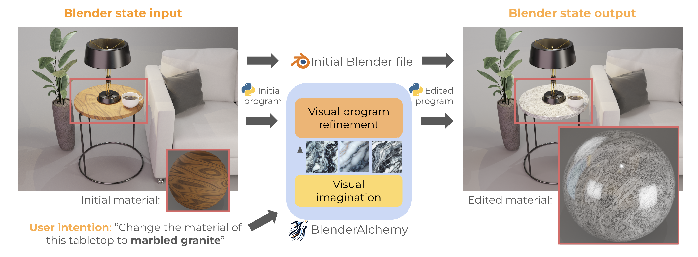
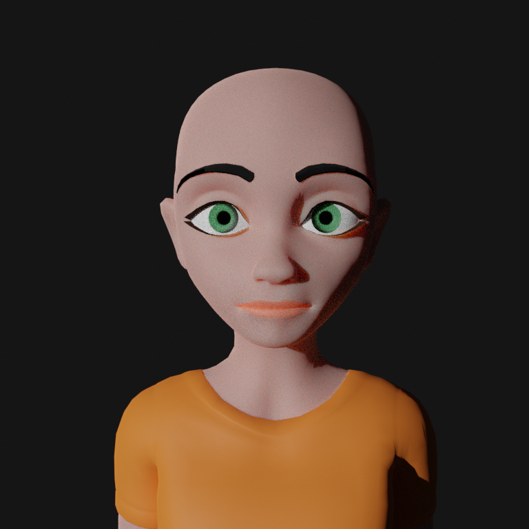
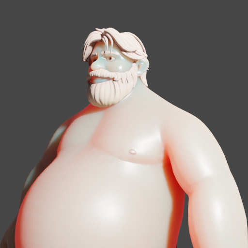
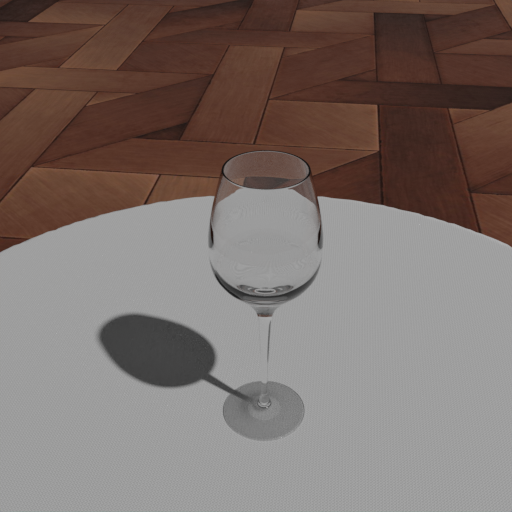

<div align="center">
</img>
</div>

# [BlenderAlchemy](https://ianhuang0630.github.io/BlenderAlchemyWeb/)
[Getting Started](#quick-start) | [Website](https://ianhuang0630.github.io/BlenderAlchemyWeb/) | [Paper](https://arxiv.org/abs/2404.17672) 

<div align="center">
</img>
</div>

## Abstract
 Graphics design is important for various applications, including movie production and game design. To create a high-quality scene, designers usually need to spend hours in software like Blender, in which they might need to interleave and repeat operations, such as connecting material nodes, hundreds of times. Moreover, slightly different design goals may require completely different sequences, making automation difficult. In this paper, we propose a system that leverages Vision-Language Models (VLMs), like GPT-4V, to intelligently search the design action space to arrive at an answer that can satisfy a user's intent. Specifically, we design a vision-based edit generator and state evaluator to work together to find the correct sequence of actions to achieve the goal. Inspired by the role of visual imagination in the human design process, we supplement the visual reasoning capabilities of VLMs with "imagined" reference images from image-generation models, providing visual grounding of abstract language descriptions. In this paper, we provide empirical evidence suggesting our system can produce simple but tedious Blender editing sequences for tasks such as editing procedural materials and geometry from text and/or reference images, as well as adjusting lighting configurations for product renderings in complex scenes. 


If you use this code or would like to cite our work, please cite:
```
@article{huang2024blenderalchemy,
  title={BlenderAlchemy: Editing 3D Graphics with Vision-Language Models},
  author={Huang, Ian and Yang, Guandao and Guibas, Leonidas},
  journal={arXiv preprint arXiv:2404.17672},
  year={2024}
}
```


## Quick Start

Follow the setup instructions outlined in [environment setup](#Environment-setup). Ensure that you have API keys for the models that you'd like to use stored on disk in a text file somewhere, and that you know the path. This is important because you will specify this in the **config yaml**.

Calls to BlenderAlchemy follow this structure:
```bash
python main.py \
--starter_blend [PATH_TO_BLENDER_FILE] \
--blender_base [PATH_TO_RENDERING_SCRIPT] \
--blender_script [PATH_TO_EDITABLE_SCRIPT] \
--config [PATH_TO_CONFIG_YAML]
```
where:
* `PATH_TO_BLENDER_FILE` points to the location of the blender project you'd like it to edit.
* `PATH_TO_EDITABLE_SCRIPT` points to the script that is getting edited by BlenderAlchemy at every step.
* `PATH_TO_RENDERING_SCRIPT` points to the script that `exec`s the `EDITABLE_SCRIPT` and then renders.
* `PATH_TO_CONFIG_YAML` points to a config yaml that stores several useful things to control the run, including the **text/image prompt**, as well as the hyperparameters used such as the **breadth** and **width** of the system. This is also where you specify the models you would like to use (GPT4V, Gemini, Claude ...etc) for the edit generator or state evaluator. We have observed the best performance with GPT4V so far. Additionally, you specify the link to the API keys for different models here.

With that, let's use BlenderAlchemy to modify some facial expressions!

```bash
python main.py --starter_blend starter_blends/face_animation.blend --blender_base blender_base/bodyshape_shapekeys.py  --blender_script blender_scripts/shapekeys_examples/facialshapekeys.py --config configs/blendshapes_face.yaml
```
Before you run this, double check a few things within `configs/blendshapes_face.yaml`:
1. `run_config.blender_command` is set to the infinigen blender binary. This may be different from what is currently set if you followed the installation instructions on a Mac. 
2. `credentials.openai`, `.claude` and `.gemini` should be valid paths to text files containing the corresponding API keys. You only need to specify them if you plan on using the corresponding models for either the edit generator (`run_config.edit_generator_type`) and state evaluator (`run_config.state_evaluator_type`).
3. `output.output_dir` is going to be the output directory. 

After running the above, you should see that BlenderAlchemy has created `instance0`, `instance1`, `instance3` and `instance4` under `output/winky_face` (or whichever `output.output_dir` you've specified.) Each folder under `instanceX` will be named according to the hyperparameters. In each of *those* folders, you should see `best_of.png` (the final output of BlenderAlchemy) and `init_render.png` (the input into BlenderAlchemy). `renders/` holds the renders done throughout the whole process (`[unique_id].png`), and `scripts/` holds the corresponding python scripts (`[unique_id].py`). `thought_process/` holds json files that store the edits and state evaluations within every iteration of the BlenderAlchemy procedure. 

## Accessing candidate and final edits 

Suppose you like the visual outputs of `output/winky_face/instance2/tune_d4_b8`. You can then extract everything you need (all code and renderings generated in the process) by using the `get_candidate_and_winner()` function:

```python
from utils.records import *
from pathlib import Path

CHOSEN_DIR = "output/winky_face/instance2/tune_d4_b8" # you can replace this

# we extract the paths to the code files 
candidates_code, winners_code = get_candidate_and_winner(Path(CHOSEN_DIR), type="code")
# we extract the paths to the corresponding renders
candidates_render, winners_render = get_candidate_and_winner(Path(CHOSEN_DIR), type="image")

# Each element of `candidates_code` is a list of file paths to code candidates generated by the edit generator.
# For instance, to get access to the set of code candidates in the final iteration of BlenderAlchemy,
final_code_candidates:list[str] = candidates_code[-1]
final_render_candidates:list[str] = candidates_render[-1]

# `winners` is a list of the winners of each iteration.
# to get the path to the final winner's code,
final_code_winner:str = winners_code[-1] 
final_render_candidates:str = winners_render[-1]
```

This is useful if you'd like to run the script directly on your blender project to implement the edit, then manually tweak from there. Or alternatively, you may have liked one of the candidates better than the one chosen by BlenderAlchemy, and may want to have access to the python script corresponding to *that* edit instead. 

## Starting scripts for different task instances
### Material editing

<div align="center">
</img>
</div>

To change this into a material that resembles marbled granite (prompt: `Marbled Granite: Enhanced with white and gray streaks and a glossy finish`),
```bash
python main.py --starter_blend starter_blends/BSDF_experiments.blend --blender_base blender_base/infinigen_render_materials.py  --blender_script blender_scripts/material_examples/infinigen_wood_example.py --config configs/wood_to_marble.yaml
```

You can replace `blender_scripts/material_examples/infinigen_wood_example.py` with any other starter file within `blender_scripts/material_examples` if you want a different starting material. Make sure that you're also changing the prompts (image or language) within the config file accordingly.


### Blend Shapes

#### Facial Expressions

Within `starter_blends/face_animation.blend`:

<div align="center">
</img>
</div>

To turn a face that looks like this into `a female character that's saying "Ugh, this milk has gone bad. It smells awful!"`
```bash
python main.py --starter_blend starter_blends/face_animation.blend --blender_base blender_base/bodyshape_shapekeys.py  --blender_script blender_scripts/shapekeys_examples/facialshapekeys.py --config configs/blendshapes_ew.yaml
```

#### Body shape
Within `starter_blends/body_shapekeys.blend`:
<div align="center">
</img>
</div>

To turn a man that looks like this into `a muscular middle-aged lumberjack`,
```bash
python main.py --starter_blend starter_blends/body_shapekeys.blend --blender_base blender_base/bodyshape_shapekeys.py  --blender_script blender_scripts/shapekeys_examples/bodyshape.py --config configs/blendshapes_body.yaml
```

#### Wine glass 
Within `starter_blends/wineglass_shapekeys.blend`:
<div align="center">
</img>
</div>

To turn a glass that looks like this into `a champagne flute`,
```bash
python main.py --starter_blend starter_blends/wineglass_shapekeys.blend --blender_base blender_base/bodyshape_shapekeys.py  --blender_script blender_scripts/shapekeys_examples/wineglass.py --config configs/blendshapes_wineglass.yaml
```

### Editing Lighting 

Within `starter_blends/lotion.blend`:
<div align="center">
</img>
</div>

To give this more of a nightclub-like lighting,
```bash
python main.py --starter_blend starter_blends/lotion.blend --blender_base blender_base/lighting_adjustments.py  --blender_script blender_scripts/lighting_examples/lotion.py --config configs/lighting.yaml
```

### Editing Geometry Nodes

Within `starter_blends/roses.blend`:

<div align="center">
</img>
</div>

To make these roses bloom more:

```bash
python main.py --starter_blend starter_blends/roses.blend --blender_base blender_base/geonodes.py  --blender_script blender_scripts/geonodes_example/roses.py --config configs/roses.yaml
```


## Environment setup 

### Step 1: Setup conda environment, and install relevant base libraries.

```bash
conda create -n blenderalch python=3.10
conda activate blenderalch

# clone this repo
git clone git@github.com:ianhuang0630/BlenderAlchemyOfficial.git

# install the TaskSolver library
git clone git@github.com:ianhuang0630/TaskSolver.git
# ... and install as package
cd TaskSolver
pip install -e .
cd ../
```

### Step 2: Setup Infinigen
```bash
cd BlenderAlchemyOfficial 
git clone https://github.com/princeton-vl/infinigen.git
cd infinigen
INFINIGEN_MINIMAL_INSTALL=True bash scripts/install/interactive_blender.sh
cd ..
```
Refer to the original [Infinigen documentation](https://github.com/princeton-vl/infinigen/blob/main/docs/Installation.md) for additional details about compatibility with different systems, and more.

### Step 3: Add your API keys for different LLMs

Put your API keys into a txt file. Remember the path to these files, since you will be providing them in the configs for BlenderAlchemy runs. 

### Step 4 (Optional): Setting up Ollama for local LLM calls
Should you choose to use open-sourced models supported by Ollama, you should follow the download instructions [here](https://ollama.com/download).

If you're launching this on a (headless) server, you may have to start the server in the background:
```bash
ollama serve
```

Before using a model (e.g. `mistral`), make sure to pull it first:
```bash
ollama pull mistral
```

